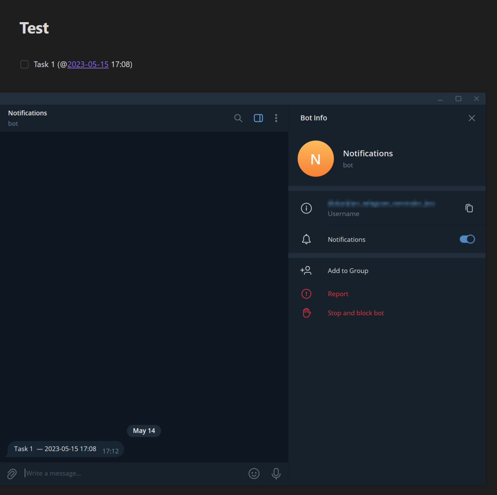

# Obsidian Telegram Reminder Plugin
> I created this plugin for myself. It includes only the necessary functionality. <br>
> I haven't published this plugin in the official list of Obsidian plugins

Telegram Reminder Plugin for Obsidian. This plugin allows you to configure notifications to be sent to your Telegram bot.



## Download
Link

## Usage

Download the plugin and insert it into the plugins path of your Obsidian vault:
```
*your_obsidian_vault*\.obsidian\plugins\
```

1) Create a Telegram bot using https://t.me/botfather and obtain a token;
2) Insert this token in the plugin settings (Telegram Bot Token);
3) After entering the token, send any message to your bot. You will receive a chat ID in response;
4) Insert this chat ID in the plugin settings (Chat ID);
5) Done!

You can set reminders for items using the following format:

```
- [ ] Task 1 (@2023-05-14)
- [ ] Task 2 (@2023-05-15 09:10)
- [x] Task 3 (@[[2023-05-16]])
- [ ] Task 4 (@[[2023-05-16]] 09:40)
```

## Settings
**Telegram Bot Token** — Create a Telegram bot using https://t.me/botfather and obtain the token. <br>
**Сhat ID** — After entering the token, send any message to your bot. You will receive a chat ID in response. <br>
**Parsing time** — The interval (in minutes) at which new dates for notifications will be parsed. <br>
**First notice** — The number of minutes before the event to send the first notification. <br>
**Second notice** — The number of minutes before the event to send the second notification. <br>
**Clear cache** — Clear the cache of dates and sent marks. <br>

## Support

https://www.donationalerts.com/r/ibird
